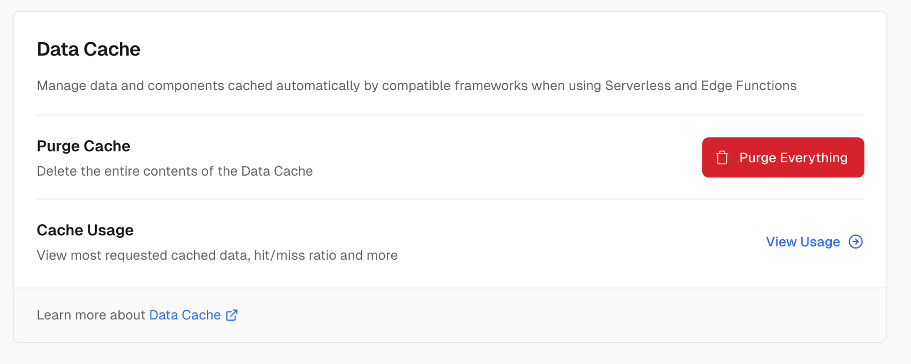

# Next.js 캐싱

## 트러블 슈팅

### 문제

Next.js의 캐싱 시스템에서, 삭제된 데이터가 여전히 사용자에게 렌더링되는 문제가 발생했습니다. 이로 인해 잘못된 데이터가 표시되는 현상이 있었습니다.

- 상세 글 페이지에서 조회수 기능을 제공하기위해서 `unstable_cache`로 캐싱해두었기 때문에 일어난 일입니다. 좋아요와 댓글 상호작용이 일어 날 경우에 게시글을 다시 불러오게 된다면 조회수가 증가하는 로직을 방지하고자 캐시를 선택했습니다.
- 하지만, 이로인해서 글이 삭제하거나 사용자 정보를 변경하는 등의 변경이 일어 날 때에 캐싱 된 값이 컨트롤 되지 않은 상황으로 문제를 발생시켰습니다.
- 아래의 사진에서 35분 3.41km 이미지를 분석하여 AI 코멘트가 생성된 게시글에서 작성자 정보와 이미지, 글 내용이 상이한 것을 확인할 수 있습니다.

| 캐싱된 데이터를 렌더하는 잘못된 상황 (배포 환경의 모든 사용자가 보이는 상황) | 실제 올바르게 렌더한 상황  (개발 환경) |
| -------------------------------------------------------------------------------- | ------------------------------------------ |
|                                                  |            |

### 해결

Next.js의 캐싱 데이터를 관리하는 방식을 변경하여 삭제된 데이터가 캐시에 남아있지 않도록 처리했습니다.

### 해결 과정

#### 1) 코드상의 캐시 컨트롤

Next.js의 unstable_cache를 사용하여 캐싱한 데이터 중, 삭제된 데이터가 여전히 캐시된 상태로 남아있는 이슈가 있었습니다.  이를 해결하기 위해, **revalidateTag**와 **revalidatePath**를 사용하여 캐시 데이터를 섬세하게 관리하고, 삭제된 데이터가 렌더링되지 않도록 했습니다.

- 상세 인증글을 unstable_cache 할 때에 `[post-detail-${postId},: 'user-profile']` 캐시키 추가
- 사용자 정보수정 완료 시 `revalidate("user-profile")`을 실행하여 캐시히트 일으켜 캐시 무효화 시킴
- 인증글을 삭제할 경우 `revalidatePath("/posts/${postId}")`을 실행하여 캐시히트 일으켜 캐시 무효화 시킴

#### 2) CDN에 배포된 캐싱된 값 제거

CDN에 남아있는 잘못된 배포환경 캐싱 데이터를 완전히 제거하여 사용자들이 최신 데이터를 정확하게 볼 수 있도록 했습니다.

- 배포환경에서 캐싱된 데이터를 제거하기 위해서 `Vercel > Setting > Data Cache > Purge everything` 을 진행합니다.
  

---

- [관련 풀리퀘스트](https://github.com/j2h30728/boost-pal/pull/29)
